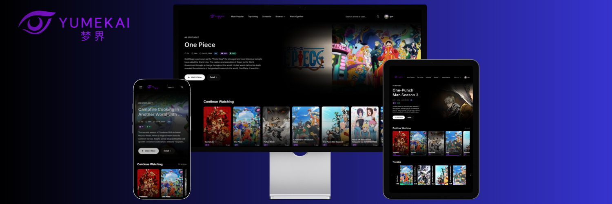

# Yumekai

A modern anime streaming platform built with Next.js 16.

---

## Overview

Yumekai is a full-featured anime streaming platform that combines elegant design with powerful functionality. The platform offers seamless browsing, watching, and scheduling capabilities with an immersive user experience.

### Key Highlights

- Server-side rendering for optimal performance
- Real-time schedule updates
- User authentication with Firebase
- Personalized watchlists and continue watching
- Watch2gether rooms for synchronized viewing
- Responsive design across all devices

---

## Features

- **Modern UI** - Dark gradient design with frosted glass navigation and responsive hero carousel
- **Smart Player** - Multi-server support, episode navigation, expandable mode, and "lights off" viewing
- **Social** - User profiles, custom lists, Watch2gether rooms, and rankings
- **Discovery** - Daily schedules, genre filtering, advanced search, and curated categories

---

## Tech Stack

| Technology   | Version | Purpose                            |
| ------------ | ------- | ---------------------------------- |
| Next.js      | 16.0.7  | App Router, SSR, API routes        |
| React        | 19.1.0  | UI components and state management |
| TypeScript   | 5.x     | Type safety                        |
| Tailwind CSS | 4.x     | Utility-first styling              |
| Firebase     | 11.x    | Authentication and Realtime DB     |
| Turbopack    | -       | Development builds                 |

---

## Performance

- Server-side rendering for fast initial page loads
- Image optimization with Next.js Image component
- Lazy loading for below-the-fold content
- API response caching with configurable TTL
- Turbopack for rapid development iteration

---

## License

This project is for educational & private use. All anime content and metadata are provided through third-party APIs.
